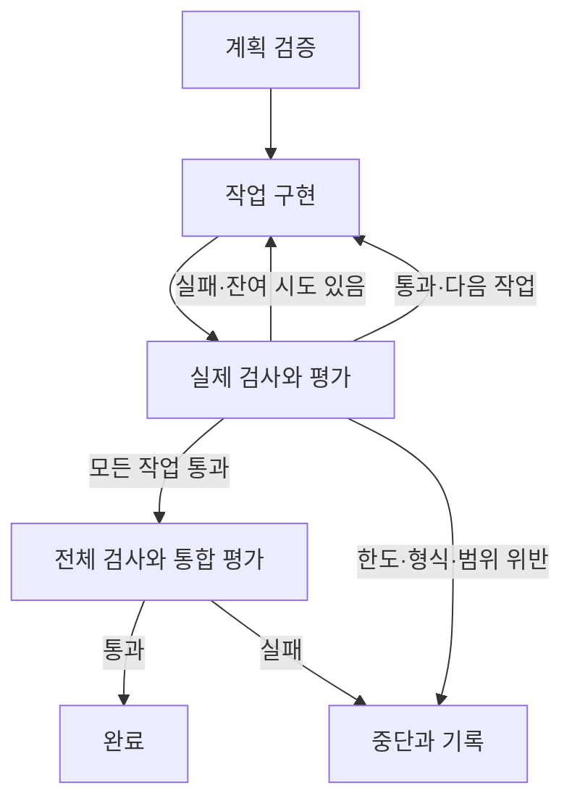

# 구조와 설계 의도

## 책임 분리

| 모듈 | 책임 |
|---|---|
| cli.py | init / run / doctor / status / demo |
| config.py | 설정 검증과 프로젝트 문서 생성 |
| engine.py | 실행 상태, 재시도, 완료 판단, 로그 |
| providers.py | Codex·Claude·일반 명령 연결 |
| contracts.py | 계획·평가 JSON 및 완료 게이트 |
| filesystem.py | 내용 해시, 수정 범위, 원자 저장, 동시 실행 잠금 |
| process.py | stdin 프롬프트, 타임아웃, 프로세스 종료, 출력 제한 |
| context.py | 역할 지침, PRD, 활성 작업, 최근 실패·기억 전달 |
| verification.py | 0개 테스트를 실패로 처리하는 unittest 실행기 |
| demo.py | SQLite 예제의 실패→수정→완료 재현 |

## 실행 상태

모델의 출력은 제안입니다. 엔진만 완료 목록·상태를 갱신합니다.
Planner/Evaluator는 파일을 수정하지 않고 최종 JSON을 stdout 또는 CLI 출력 파일로 반환합니다.
Generator가 작업 경로 밖을 수정하거나 평가자가 기존 dirty 파일을 다시 수정하면 내용 해시 비교로 중단합니다.

검사는 모든 작업마다 같은 프로젝트 검사 목록을 실행합니다. 작업별 수용 기준은 JSON 계획과 평가에 포함됩니다.
마지막에는 모든 작업 기준을 합쳐 PRD 전체 통합 평가를 다시 요청합니다.

## 의도적 범위 제한

- 병렬 에이전트와 자동 배포는 포함하지 않습니다. 3역할을 순차적으로 호출합니다.
- 자동 Git 커밋·롤백 대신 상태·변경 해시를 보관합니다. 사용자의 기존 변경을 되돌리지 않습니다.
- 모델이 새 검사 명령을 만들어 즉시 실행하게 하지 않고, 사람이 시작 전에 지정한 검사 목록을 사용합니다.
- 상태·PRD·설정 변경은 명시적으로 새로운 실행의 입력으로 취급합니다.
- 과도한 문맥을 자동 요약해 핵심 요구사항을 누락시키지 않습니다. 최근 기억은 짧게 유지하고 필수 문맥 초과는 알립니다.

## 평가 계약

`token`, `task_id`, `verdict`, `spec_score`, `test_score`, `criteria`, `issues`를 모두 요구합니다.
중복 키·누락 키·추가 키·잘못된 값·과거 호출 토큰은 거부합니다.
기준의 순서와 원문도 계획과 일치해야 합니다. JSON 스키마 검증을 외부 패키지 없이 수행합니다.

## 운영 한계

프로젝트 파일은 신뢰하는 로컬 작업 대상으로 전제합니다. 파일 감시는 사후 탐지이며 격리가 아닙니다.
동일 OS 권한으로 실행되는 프로그램은 하네스 제어 파일에 접근할 수 있습니다.
불변 평가셋, 검증 컨테이너, 별도 권한 사용자, 네트워크 정책은 후속 운영 강화 사항입니다.
통제할 수 없는 부작용을 되돌리는 제품이라는 보장은 하지 않습니다.
